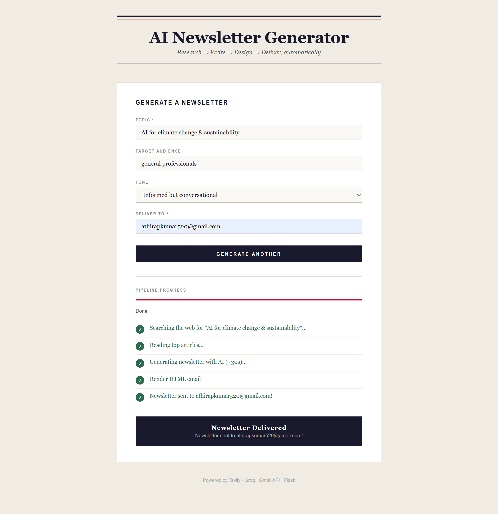
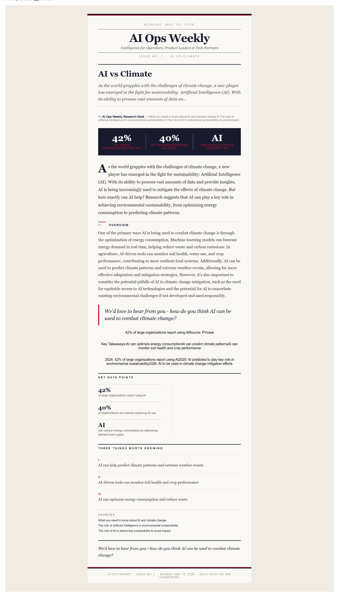

# AI Newsletter Automation

Give it a topic → get a polished HTML newsletter in your Gmail inbox.

Built on the **WAT framework** (Workflows, Agents, Tools): AI handles reasoning, Python scripts handle execution.

## Live Demo

Deployed at: **https://newsletters-demo.onrender.com**



Enter a topic, audience, tone, and email — all 5 pipeline steps run automatically and each shows a green tick as it completes.

## Newsletter Output

Topic: *AI for climate change & sustainability*



> *WSJ-inspired editorial layout with inline SVG infographics, delivered straight to Gmail.*

## What It Does

1. Searches the web for recent articles on your topic (Tavily)
2. Fetches and extracts full article text
3. Generates structured newsletter content with SVG infographics (Groq / Llama 3.3 70B)
4. Renders a WSJ-inspired HTML email via Jinja2
5. Sends it to your Gmail inbox via the Gmail API

## Setup

**1. Install dependencies**
```bash
pip install -r requirements.txt
```

**2. Add API keys to `.env`**
```
TAVILY_API_KEY=your_key        # tavily.com — free tier
GROQ_API_KEY=your_key          # console.groq.com — free tier
GMAIL_SENDER=you@gmail.com
```

**3. Set up Gmail OAuth**
- Create a project in [Google Cloud Console](https://console.cloud.google.com)
- Enable the Gmail API
- Create OAuth 2.0 credentials → download as `credentials.json`
- Add your email as a test user under OAuth consent screen
- Run `python tools/send_email_gmail.py` once to complete the browser auth flow (saves `token.json`)

## Running the Web App

```bash
python app.py
```

Then open **http://127.0.0.1:8080** in your browser.

## CLI Usage

```bash
python tools/search_web.py --topic "AI in operations" --max-results 10
python tools/fetch_article.py --url <url>
python tools/generate_newsletter_content.py --topic "AI in operations" --audience "product leaders"
python tools/render_newsletter_html.py
python tools/send_email_gmail.py --subject "Your subject here"
```

Or follow the full SOP in [workflows/generate_newsletter.md](workflows/generate_newsletter.md).

## Project Structure

```
app.py          # Flask web app
tools/          # Python scripts (search, fetch, generate, render, send)
templates/      # Web app HTML
workflows/      # Markdown SOPs defining the end-to-end process
assets/         # Screenshots
.tmp/           # Intermediate files (regenerated each run)
.env            # API keys (never commit this)
```

## Stack

| Task | Tool |
|---|---|
| Web interface | Flask |
| Web research | Tavily API |
| Content generation | Groq (Llama 3.3 70B) |
| HTML templating | Jinja2 |
| Infographics | LLM-generated inline SVG |
| Email delivery | Gmail API (OAuth 2.0) |
